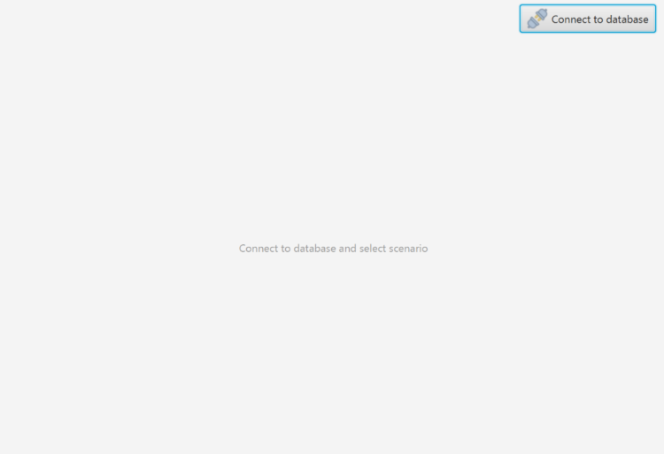
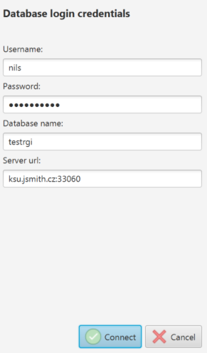
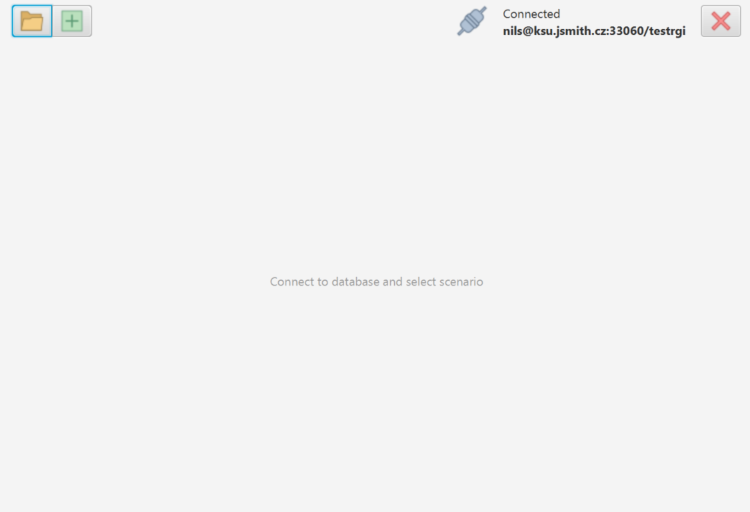
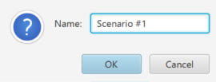
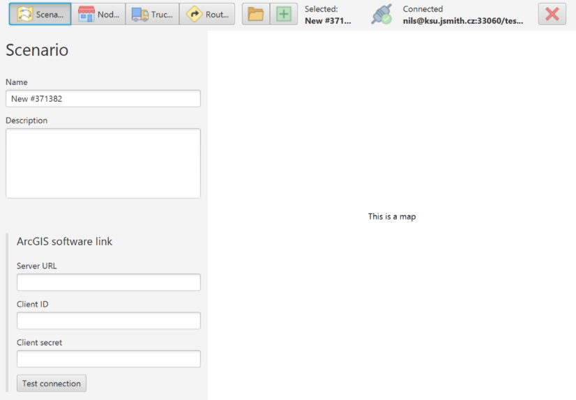
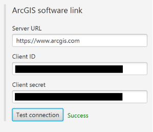
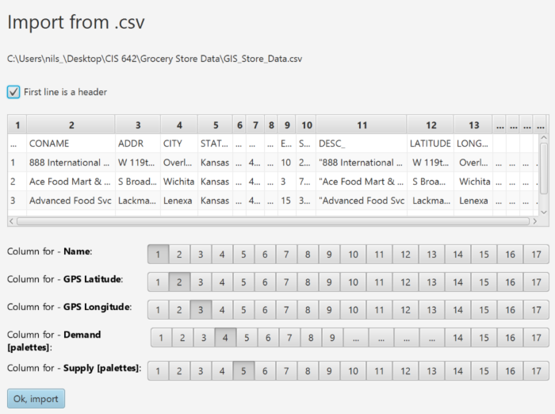
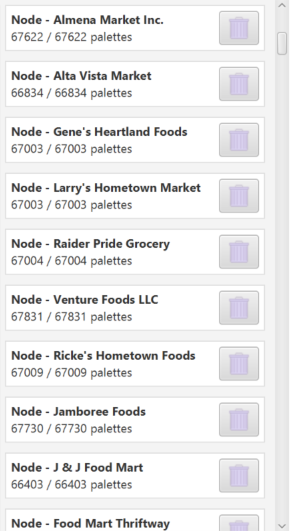

# Rural Grocery Network Optimizer
### User Documentation
***
## Connecting to the Database

Open the application and click the “Connect to Database” button 

On the ensuing popup, enter your credentials as well as the database name and server url. Click the connect button to make the connection.

If you are successfully connected, you should be presented with the main menu of the application with your connection information in the top right corner. Click the red X button to close the connection.

## Scenarios

Scenarios are used to store and manipulate data about a network of grocery stores. The application will use this data to determine optimal distribution networks.

### Creating a Scenario

To create a scenario, click the green plus button on the upper left corner of the main page.

Name the scenario and press OK to create it. This will take you to the Scenario page .

### Opening a Scenario

To open an existing scenario, click the folder button to open the Select Scenario screen. Click the blue arrow to the right of a scenario to open it.

### Scenario Overview

When a scenario is loaded, this screen will be displayed to provide the user the with an overview of the scenario.

### ArcGIS Software Link

ArcGIS is the technology behind the routing capabilities of the application. The application uses a web interface to interact with ArcGIS, and a client ID and client secret token are required to access the ArcGIS server. Enter the ArcGIS web server along with those credentials here and click the Test Connection button to see if your connection is functioning properly. It tests this by using the Client ID and Client Secret to retrieve an ArcGIS temporary token from the main ArcGIS API. 

## Nodes

A node represents a grocery store or distribution center to be used in the calculations for the application. One can manually enter nodes via the main nodes page or mass import node data from a .csv file. 

To import nodes from a .csv file, click the Import nodes from .csv button, which will open a file selection prompt. Select the .csv file you wish to import data from.

Clicking the open button when you have your data selected will prompt you with the Import from .csv dialogue. In this you can select which columns correspond to the data needed for a node object. If the spreadsheet doesn’t have a particular field (in the example below, supply), click a selected column number to deselect it.

Once the desired columns are selected, a message will appear to the user indicating either failure:

Or success: 

##### TODO: image of successful import

A scrollable list of the different nodes will appear in the left sidebar of the nodes page. Click on a node to load/edit it's data.

## Trucks

This page outlines a truck that is available to transport groceries. Enter the information for a truck and click the Add Truck button to add it to the database.

## Routes

Click the calculate button on this page to calculate the best route to take while distributing groceries in your network.

