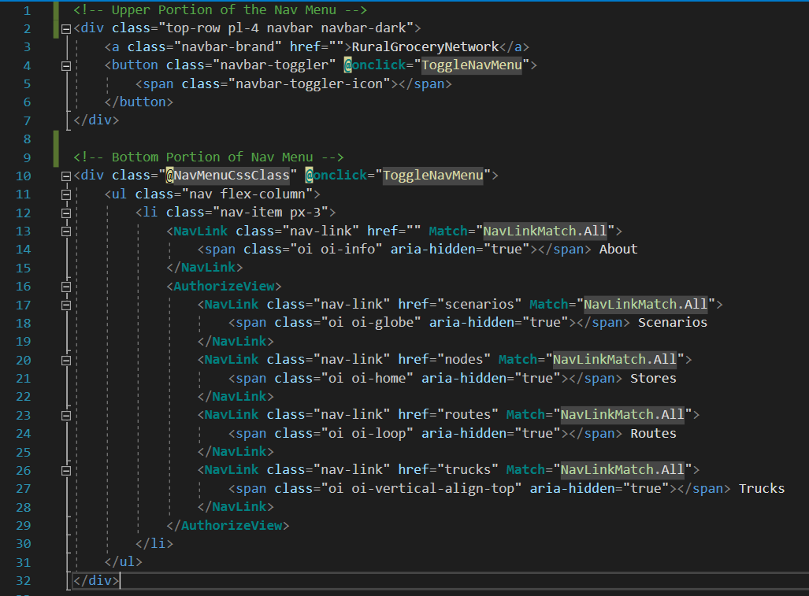
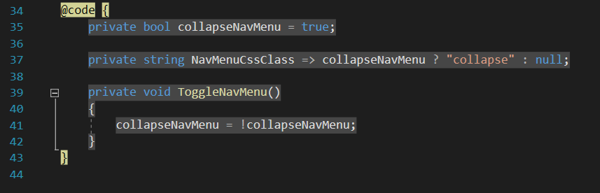

# Rural Grocery Network Web Application - Developer Documentation
***
### Blazor Installation and .NET Core
Blazor is a framework that utilizes .NET Core in building Web-Based Applications. It allows for the use of
C# in building websites along with HTML, though javascript can still be used as well. .NET
is one of the standard libraries used for Microsoft Applications, and has different versions
based on its purpose, such as .NET Framework and .NET Core. Blazor specifically uses ASP.NET Core
since it is useful for building web applications.

Link to blazor installation guide: https://docs.microsoft.com/en-us/aspnet/core/blazor/get-started?view=aspnetcore-3.1&tabs=visual-studio

### SQL Server
For storing data for the website, we are using a SQL Server that is stored locally with the project, then deployed
with the project through Microsoft Azure onto the web. You will need to download SQL Server in order to run
a local Database in Visual Studio.

Link to SQL Server Download (2019): https://www.microsoft.com/en-us/sql-server/sql-server-downloads

NOTE: When choosing a version, choose the "Developer" Version.

### ArcGIS
Our application aims to provide optimal route distributions for rural grocery stores. To accomplish this, we will
be using a map made using the ArcGIS Framework. Users of this application will need to register an ArcGIS account in
order to utilize the full functionality of this application. An ArcGIS map can be implemented in many different ways,
but right now we are integrating it using Javascript. There is a .NET implementation, but as of now it is very
barebones so we are using Javascript since it has more features and tutorials on how to integrate the functionality
for our web application. We are still trying to work on the .NET version of a map, but the javascript implementation
has more priority at this point in time.

Link to ArcGIS Website: https://www.arcgis.com/home/index.html

ArcGIS Tutorials: https://developers.arcgis.com/labs/browse/?product=arcgis-online&topic=any

### Blazor Pages and Components
A Blazor Web App is built on Components, which usually consist of a
UI Element that can be used repeatedly throughout your application. Some examples include
things like a single page or a web form. Components are made using Razor markup syntax, and 
the filetype is .razor.

Let us look at some examples in our project. First let us look at ScenarioPages.razor:

Razor pages use syntatic sugar to help define parts of a web page. '@page' defines the route that this page will be on the website, so the route will look like: 'https://ruralgrocerynetwork.azurewebsites.net/scenarios' when on this specific web page. @inject "injects" a dependency for the page, which in this case is a Class used to hold our Scenario data. @code is the area where we implement our C# code to make the webpage function, which for this page it currently doesn't have any additional functionality yet. Aside from that, We also build the page using HTML, while utilizing a built-in Blazor feature called 'AuthorizeView', which is a blazor HTML tag that hides parts of a web page depending on if a user is authenticated/authorized on that page or not.

Next, let us look at our NavMenu Component in NavMenu.Razor:

This component builds the Navigation Menu for our site, which allows us to view the different pages without memorizing the page routes.
Here we can see that it Utilizes "AuthorizeView" tags to hide it from unathorized users, and also another new feature called NavLink which is a tag that allows us to link an element to one of the other pages on the website, using the route name for that page (the element defined in @page). This Component also has C# in the @code section in order to control the Nav Menu from expanding and collapsing.

This page ends up looking like this:

More info. on Blazor web components: https://docs.microsoft.com/en-us/aspnet/core/blazor/components?view=aspnetcore-3.1

More info. On Razor syntax: https://docs.microsoft.com/en-us/aspnet/core/mvc/views/razor?view=aspnetcore-3.1
