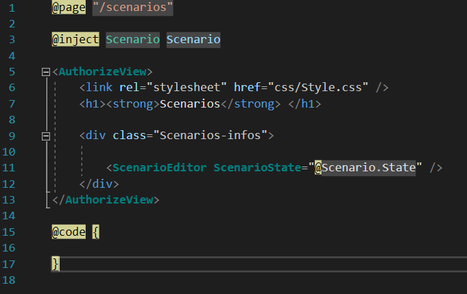

# Rural Grocery Network Web Application - Developer Documentation
***
### Blazor Installation and .NET Core
Blazor is a framework that utilizes .NET Core in building Web-Based Applications. It allows for the use of
C# in building websites along with HTML, though javascript can still be used as well. .NET
is one of the standard libraries used for Microsoft Applications, and has different versions
based on its purpose, such as .NET Framework and .NET Core. Blazor specifically uses ASP.NET Core
since it is useful for building web applications.

Link to blazor installation guide: https://docs.microsoft.com/en-us/aspnet/core/blazor/get-started?view=aspnetcore-3.1&tabs=visual-studio

### Website Deployment
Our Web Application is currently setup to deploy using Microsoft's Azure App Service.

Click here for a guide on Deployment: https://docs.microsoft.com/en-us/azure/app-service/deploy-continuous-deployment

### SQL Server
For storing data for the website, we are using a SQL Server that is stored locally with the project, then deployed
with the project through Microsoft Azure onto the web. You will need to download SQL Server in order to run
a local Database in Visual Studio.

SQL Server Download (2019): https://www.microsoft.com/en-us/sql-server/sql-server-downloads

NOTE: When choosing a version, choose the "Developer" Version.

### ArcGIS
Our application aims to provide optimal route distributions for rural grocery stores. To accomplish this, we will
be using a map made using the ArcGIS Framework. Users of this application will need to register an ArcGIS account in
order to utilize the full functionality of this application. An ArcGIS map can be implemented in many different ways,
but right now we are integrating it using Javascript. There is a .NET implementation, but as of now it is very
barebones so we are using Javascript since it has more features and tutorials on how to integrate the functionality
for our web application. We are still trying to work on the .NET version of a map, but the javascript implementation
has more priority at this point in time.

Users will need an ArcGIS account to use the map, though we have found useful information for setting up authentication such that the log in isn't needed. Click the following link to learn more about it.

ArcGIS Authenticated Services: https://developers.arcgis.com/labs/arcgisonline/set-up-authenticated-services/

ArcGIS Website: https://www.arcgis.com/home/index.html

ArcGIS Tutorials: https://developers.arcgis.com/labs/browse/?product=arcgis-online&topic=any

### Blazor Pages and Components
A Blazor Web App is built on Components, which usually consist of a
UI Element that can be used repeatedly throughout your application. Some examples include
things like a single page or a web form. Components are made using Razor markup syntax, and 
the filetype is .razor.

Let us look at some examples in our project. First let us look at ScenarioPages.razor:

Razor pages use syntatic sugar to help define parts of a web page. '@page' defines the route that this page will be on the website, 
so the route will look like: 'https://ruralgrocerynetwork.azurewebsites.net/scenarios' when on this specific web page. 
@inject "injects" a dependency for the page, which in this case is a Class used to hold our Scenario data. 
@code is the area where we implement our C# code to make the webpage function, which for this page 
it currently doesn't have any additional functionality yet. Aside from that, We also build the page using HTML, 
while utilizing a built-in Blazor feature called 'AuthorizeView', which is a blazor HTML tag that hides parts of a web page 
depending on if a user is authenticated/authorized on that page or not.

Next, let us look at our NavMenu Component in NavMenu.Razor:

This component builds the Navigation Menu for our site, which allows us to view the different pages without memorizing the page routes. Here we can see that it Utilizes "AuthorizeView" tags to hide it from unauthorized users, and also another new feature called NavLink which is a tag that allows us to link an element to one of the other pages on the website, using the route name for that page (the element defined in @page). IsAdmin() is also called here. This is to check to make sure the user is an admin. If not, the pages within the if statement will not have a navigation tab loaded in. This Component also has C# in the @code section in order to control the Nav Menu from expanding and collapsing. It also controls the IsAdmin() method, utilizing the AdminCheck object.

The nav menu ends up looking like the following when an admin is logged on:

The Admin and Edit Pages tabs wont be visable if an admin isn't logged in.

More info. on Blazor web components: https://docs.microsoft.com/en-us/aspnet/core/blazor/components?view=aspnetcore-3.1

More info. On Razor syntax: https://docs.microsoft.com/en-us/aspnet/core/mvc/views/razor?view=aspnetcore-3.1

### Important Files
A major focus of this project is the individual pages, as well as the Components and Data that is associated with those pages.
The pages can be accessed from the RuralGroceryNetwork/Pages directory:

This directory contains 6 razor pages, along with an Error Page for when the pages don't work properly and a .cshtml for styling these pages. 
The pages we currently have are:
- EditPages.razor
- Help.razor
- Index.razor
- NodesPage.razor
- RoutesPage.razor
- RuralGroceryInitiative.razor
- ScenariosPage.razor

Our pages also integrate other components, from other folders, within them. Some examples of these kinds of components include the Website's Navigation Menu and The website's main layout, among other things. Some of these components can be found in the RuralGroceryNetwork/Shared Directory:

AdminCheck.cs is also found in the shared folder, where SQL commands are used to discover if the given user is actually an admin. This file is used for protecting admin privileges, preventing non-admins from views admin only pages and changing data.

We have also defined a few classes for keeping track of data in the RuralGroceryNetwork/Data directory. They consist of State.cs classes and .cs classes for Nodes, Routes, Scenario, StoreInformation, and Trucks pages. The .cs file stores the state of the node and the State.cs file stores the informtion for that page:

And some javascript and css files in the RuralGroceryNetwork/wwwroot directory. The Route.js file is the new file that controls the map on the pages that have one. The methods in this file are also the ones called to do varius things on the map for the diffrent pages. The RouteOld.js file is the old version of the Route.js file:

We also implemented some Database Interaction thorugh a separate project within our solution. Here is where you can find the table models and data layouts. These things can be found in the GroceryLibrary directory:

### Data Binding and Event Handling:

Click these links for detailed explanations for data binding and event handling in blazor:

Data Binding: https://docs.microsoft.com/en-us/aspnet/core/blazor/data-binding?view=aspnetcore-3.1

Event Handling: https://docs.microsoft.com/en-us/aspnet/core/blazor/event-handling?view=aspnetcore-3.1

An important aspect of blazor is that you can bind variables, methods, and events to various html elements.
This allows us to have modifiable data within HTML, from input data to even changing the attributes/css within
different tags.

Here are some examples from StoreInformationPage.razor:

HTML Element:

This page has an Accordion Menu, which is a menu that collapses and either reveals or hide information when you click on the menu panels. The boolean collapse properties are used for determining whether or not each panel is collapsed or not. The collapse state gets toggled when that panel's header get's clicked on, which is set with the razor @onclick event that is set to a lambda expression for event "e". And based on what the state of the collapse properity, in the "store-element" div we then use a conditional string binding that appends the "collapse" css style to it (defined in www/Style.css) or nothing depending on what the state is.

Text Input:

Here we have a conditional statement that shows different html elements depending on the state of whether we can edit this field or not (edit state is is toggled by hitting this panel's edit button, similary done to the collapse states. If it isn't in an edit state then it shows the current value for that field, otherwise it reveals a a text input that binds to a private string in the co when the input is modified, which can then be processed into our databased when we click the save button.

Checkbox Input:

Checkboxes work a bit differently, in that we can set it a boolean when it changes using the @onchange event, which triggers a method to toggle the current state for that checkbox (which is initially set based on values in our Database). We then show if it is checked by using that expression and binding it the checkbox's "checked" attribute.

### Other Helpful Resources:

HTML/CSS:
- w3schools: https://www.w3schools.com/

