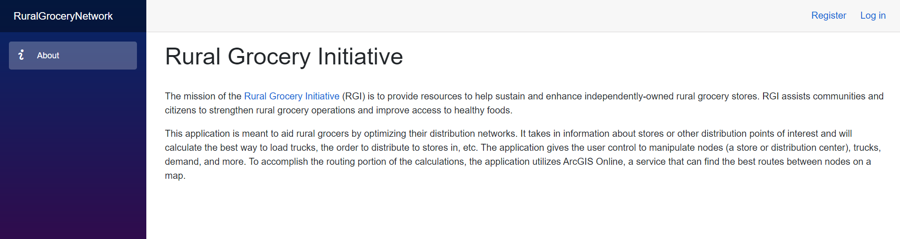
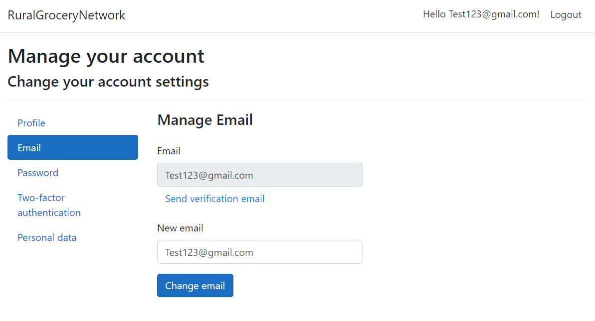
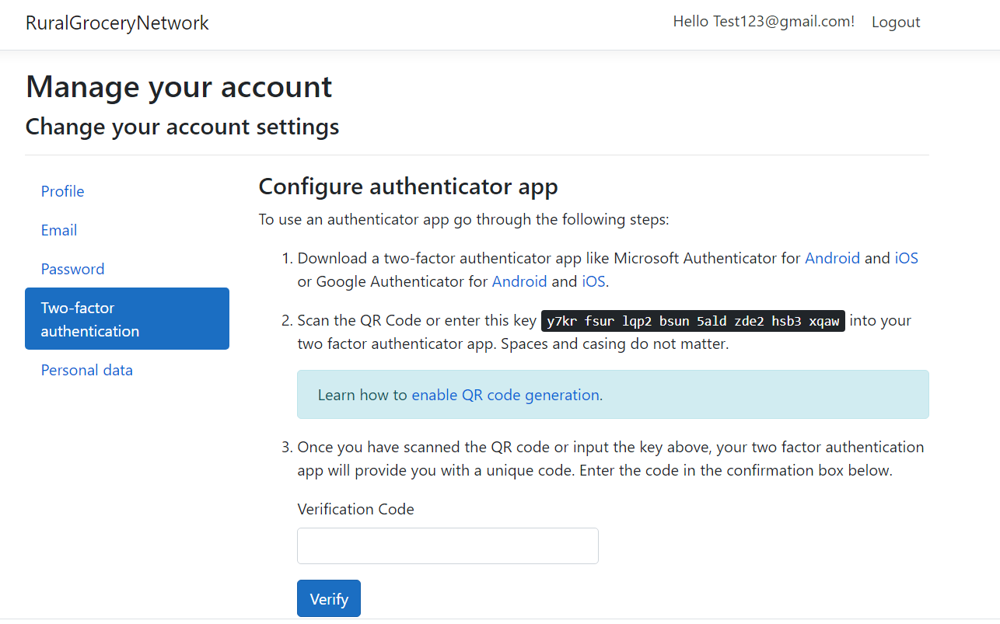

# Rural Grocery Network Web Application - User Documentation
***

Here is a link to the website: https://ruralgrocerynetwork.azurewebsites.net/

When a user first gets on the website, they first encounter an about page, along with buttons to login or register
an account for this application. 

### Login/Registration
Click one of the buttons on the upper right hand corner of the page to either create an account or login to it.

For registering an account, just enter an email address along with a password, and then enter the password again
to confirm it. We are currenlty working on account verification in order to ensure accounts are created when they
should be. Once you are done entering the information, hit the "Register" button.

To Login, you just enter the email and password that you provided in the registration. Once it is entered, hit the
"Log In" Button. Users can also click "Forgot Password" to change the password through email, or "Register as a new user" 
to redirect to the registration page. Currently the functionality for recovering/changing passwords through email is a Work-In Progress (WIP).

Once you login, you should see your email along with a logout button in place of the login and register buttons
on the upper right hand corner of the page.

### Account Settings
When logged in, click on the email on the upper right hand corner to access Account Settings. To navigate back to the main web pages, 
just click on the "RuralGroceryNetwork" Banner at the top of the page. Currently we have the following settings for user accounts:

#### Profile information
Users can change username and add/change the phone number for the account.

#### Email
This is where users can see the email associated with their account, as well as change it to a different email address. Verification
emails can also be sent as well.

#### Password
This is where users can change the password for their account. They do need to enter their previous password in this page in order to change it. 

#### Two-Step Authentication
Users can add an app to do Two-Step Authentication with. After clicking the "set up authenticator app" button, 
you get steps to add an app like Microsoft Authenticator, using QR Code generation or through a key entry that is provided in this page. 
Users can also reset their authentication key, for when they want to stop using it or want to switch authentication apps.

#### Personal Data
Any personal data associated with users can either be downloaded or deleted through this page. 
Account Information is downloaded as a JSON file. Note that deleting data does delete the account, 
but it needs password confirmation in order to accomplish it.

### Web pages
Aside from the about page, we currently have 4 pages, which are called Scenarios, 
Stores, Routes, and Trucks.

#### Scenarios Page
Scenarios are used for storing different scenarios for distribution. It allows user to name and describe scenarios, which will be saved
with the User. This page also has a form to enter arcGIS information, since the mapping portion requires a arcGIS account/license to use. 
Currently this page is a WIP.

#### Stores Page
Stores allows users to enter store locations and will allow routing between stores, along with importing store data from .CSV files.
This page also shows the routing through a map using ArcGIS. Currently the map can be clicked on to add nodes, then you also add nodes
using either latitude/longitude coordinates or actuall addresses, and routes can be drawn for those nodes. The store locations can't be pulled from
the Database as of now though, so this page is still a WIP.

#### Routes Page
Routes are where the calculations take place and will calculate the optimal route to take for distribution. This
information will be based on what is entered/retrieved in the Stores Page. Hit the "Calculate" Button to run the calculation. This page is still a WIP.

#### Trucks Page
Trucks are where truck information can be, such as the start and end location for the truck, as well as the truck name and carrying capacity. 
Hit "Add Truck" to save the truck information. This page is still a WIP.

#### Store Information Page.
This is where all the store information is currently stored, and it can also be modified and saved into the site's database. This page
has an accordion-style menu that collapses when each section's header is clicked on. We divide the information into 5 different sections, with each
section having it's own save and edit buttons, and being edited via a text entry or checkbox toggle (for the fields that are editable).
This page has database interactions, as well as functioning editing/saving of each field, but still is a WIP due

