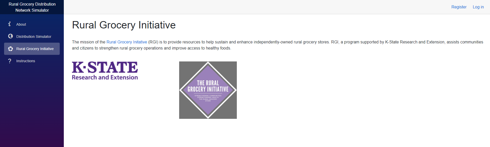

# Rural Grocery Network Web Application - User Documentation
***

Here is a link to the website: https://ruralgrocerynetwork.azurewebsites.net/

When a user first gets on the website, they will be on the about page.
If the user is not logged in, then they will be able to access the Distribution Simulator, Rural Grocery Initiative, 
and Instructions pages, along with the about page. Options to login or register will also be available.

### Login/Registration
Click one of the buttons on the upper right hand corner of the page to either create an account or login to it.

For registering an account, just enter an email address along with a password, and then enter the password again
to confirm it. We are currenlty working on account verification in order to ensure accounts are created when they
should be. Once you are done entering the information, hit the "Register" button.

To Login, you just enter the email and password that you provided in the registration. Once it is entered, hit the
"Log In" Button. Users can also click "Forgot Password" to change the password through email, or "Register as a new user" 
to redirect to the registration page. Currently the functionality for recovering/changing passwords through email is a Work-In Progress (WIP).

Once you login, you should see your email along with a logout button in place of the login and register buttons
on the upper right hand corner of the page.

### Account Settings
When logged in, click on the email on the upper right hand corner to access Account Settings. To navigate back to the main web pages, 
just click on the "RuralGroceryNetwork" Banner at the top of the page. Currently we have the following settings for user accounts:

#### Profile information
Users can change username and add/change the phone number for the account.

#### Email
This is where users can see the email associated with their account, as well as change it to a different email address. Verification
emails can also be sent as well.

#### Password
This is where users can change the password for their account. They do need to enter their previous password in this page in order to change it. 

#### Two-Step Authentication
Users can add an app to do Two-Step Authentication with. After clicking the "set up authenticator app" button, 
you get steps to add an app like Microsoft Authenticator, using QR Code generation or through a key entry that is provided in this page. 
Users can also reset their authentication key, for when they want to stop using it or want to switch authentication apps.

#### Personal Data
Any personal data associated with users can either be downloaded or deleted through this page. 
Account Information is downloaded as a JSON file. Note that deleting data does delete the account, 
but it needs password confirmation in order to accomplish it.

### Web pages
As mentioned earlier, their are four main pages: Distribution Simulator, Rural Grocery Initiative, About, and Instructions pages.

#### About Page
This page is simply information about the website. It goes into the purpose, the rural grocery network, the data, and contact information.

#### Distribution Simulator
This page allows users to view different distribution simulations. Users can load (which will load in a key) in stores and generate radius on a map.
Routes connecting the stores within the radius will appear and are generated by ArcGIS. This radius can be generated by clicking on any location on the map. 
The size of the radius can be altered in the radius size box. As of right now, simulations can only be done with the city population variable. 

Once a radius is generated a list of stores will appear along with a summary of information about those stores. Stores can be selected and deselected from the list, effecting variables in the Summary.

#### Rural Grocery Initiative
This page is an about page for the Rural Grocery Initiative.

#### Instructions
This page has three different tabs on it. The Instructions for the Scenarios Page, Examples, and FAQ.

##### Instructions for the Distribution Simulator
This page lists thorough instructions on how to use the Distribution simulator.

A video going through the instructions is also provided. 

##### Examples
This page goes over multiple examples for how the Distribution similar can be used.

##### FAQ
Here, any frequently asked questions that are asked are listed and answered. 

### Admin

If the user is logged in as an admin then the Edit Pages and Admin pages will appear. 

#### Admin
Here, admins can download current store information or upload new store data. The upload and download buttons are used to do this here. Instructions are given on how to do so on this page as well. 

#### Edit Pages
This page allows admins to edit the text on every page, excluding itself, along with the side navigation menu.

These different pages can be selected in the tab and the Edit and save buttons are used to edit or save the changes. 

